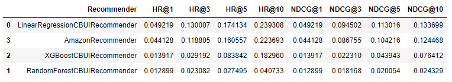

# Recommender Systems Project: Content-based recommender

Author: Piotr Kondratowicz

## Project description

The aim of this project was to create a content-based recommender based on hotel data.
The project consists of:
- data preprocessing
- creating user and item features
- coding, tuning and validating the recommender

The final goal was to achieve as high HR@10 as possible and perhaps beat Amazon Recommender.

## Results and conclusions
The results are shown in a table below:

Linear Regression Recommender (HR@10: 0.239308) was able to beat Amazon Recommender (HR@10: 0.223693).
The other recommenders (XGBoost and Random Forest) achieved worse results and did not beat Amazon Recommender.

## Requirements to run
<pre>
Python 3.8 or newer
pip install jupyter
pip install numpy
pip install pandas
pip install matplotlib
pip install seaborn
pip install sklearn
pip install hyperopt
</pre>
